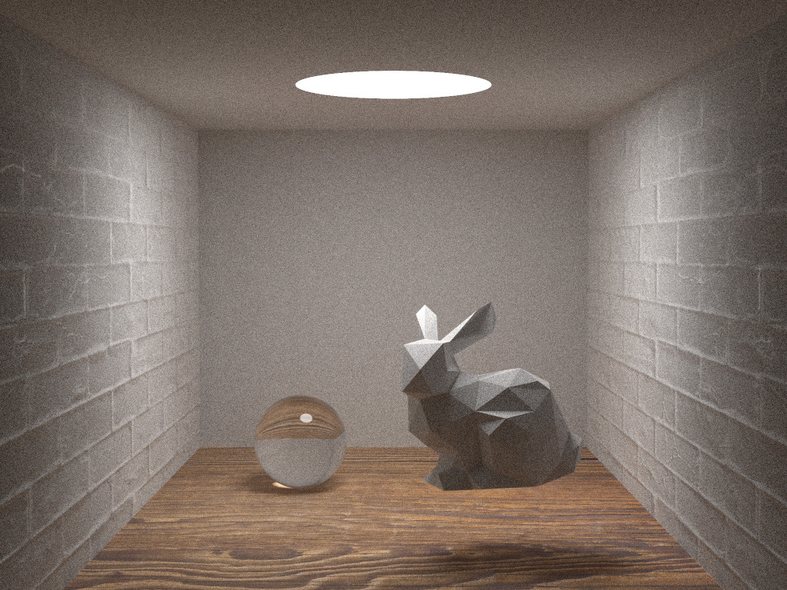
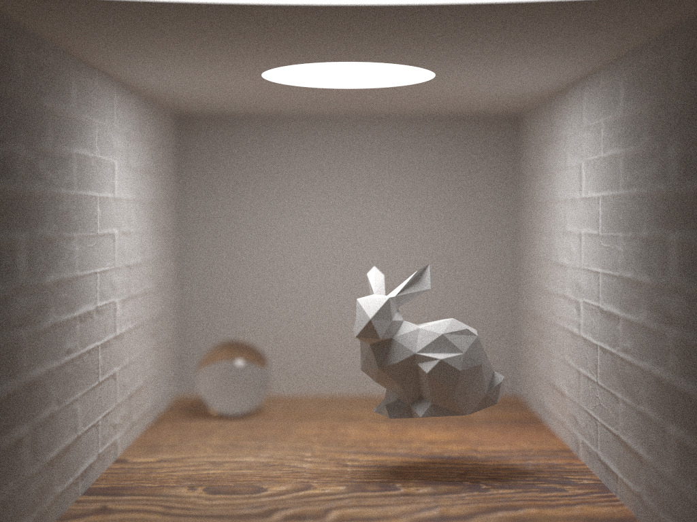
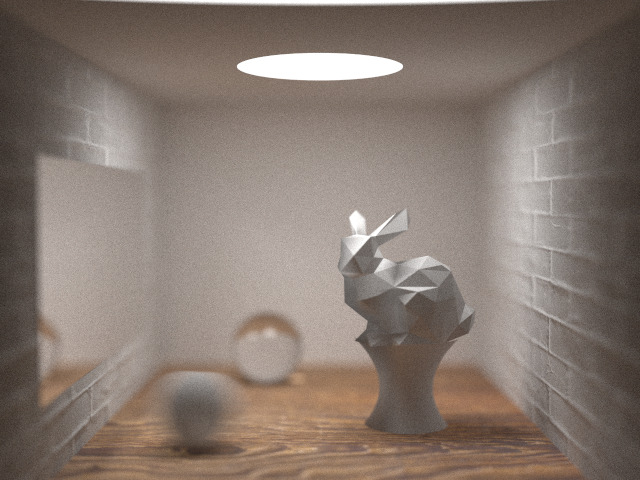

usage:
```shell
#mac
brew install imagemagick
#linux
sudo apt-get install imagemagick

bash run.sh
```

result:



# 光线追踪大作业实验报告

## 实现效果

​		本次作业主要基于[smallpt](https://www.kevinbeason.com/smallpt/)完成，使用路径跟踪的方式，在原代码的基础上实现了更多的功能，采用stb读取图片，imagemagick输出png文件。主要的得分点如下：

+ 基础项：

    + 折射
    + 反射
    + 阴影
    + 参数曲面

+ 低

    + 抗锯齿

    + 纹理贴图

    + 凹凸贴图

    + 法线贴图

+ 中

    + 漫反射

    + 景深

    + 运动模糊

    + 软阴影

+ 包围盒

## 具体实现

+ 折射、反射、阴影：

    + 基于路径跟踪的原理，反射只需返回反射后的光线继续跟踪即可，而折射需要在跟踪的光线进入或离开可折射材质表面时，对光线沿表面法向进行一个偏移，具体来讲，设定玻璃折射率为1.5，当发生全反射时直接返回反射光，当非全反射时，对折射和反射的光线分别进行追踪。阴影则是光线全部被遮挡后自然实现。具体函数为

      ```c++
      Vector3f radiance(const Ray &r, int depth, unsigned short *Xi) 
      ```

+ 参数曲面：

    + 旋转面，使用牛顿迭代法进行求交，使用柱坐标系描述曲面，对角度和参数进行迭代，具体代码见revsurface.hpp。
    + 使用光线与包围盒交点作为迭代初值，从而加速计算。

+ 抗锯齿：

    + 对每个像素内部分为4个单元格随机采样，最后取平均值，从而达到抗锯齿的效果，即

      ```cpp
      for (int sy = 0, i = (h - y - 1) * w + x; sy < 2; sy++)                                 // 2x2 subpixel rows
              for (int sx = 0; sx < 2; sx++, r = Vector3f()) {  
      ```

      与

      ```cpp
      double r1 = 2 * erand48(Xi), dx = r1 < 1 ? sqrt(r1) - 1 : 1 - sqrt(2 - r1);
      double r2 = 2 * erand48(Xi), dy = r2 < 1 ? sqrt(r2) - 1 : 1 - sqrt(2 - r2);
      ```

+ 贴图：

    + 纹理贴图（地板）：在获取物体颜色时从图片中读取，具体代码如下：

      ```cpp
      void change_hit(double u, double v, Hit &hit) override {
              int i = (int) (u * width);
              int j = (int) (v * height);
              if (i < 0) i = 0;
              if (j < 0) j = 0;
              if (i >= width) i = width - 1;
              if (j >= height) j = height - 1;
              int index = (i + j * width) * channel_num;
              double r = int(tex_data[index]) / 255.0;
              double g = int(tex_data[index + 1]) / 255.0;
              double b = int(tex_data[index + 2]) / 255.0;
              hit.hit_color = Vector3f(r, g, b);
          }
      ```

    + 法线贴图（左右砖墙）：读取图片文件中记录的法线偏移信息，对已经获得的hit中的法向量进行偏移，具体代码如下：

      ```cpp
      double r = int(tex_data[index]) / 255.0;
              double g = int(tex_data[index + 1]) / 255.0;
              double b = int(tex_data[index + 2]) / 255.0;
              hit.hit_normal = hit.hit_normal + Vector3f(r - 0.5, g - 0.5, b - 0.5)*1.3;
      ```

    + 凹凸贴图（地板）：对hit记录的交点信息沿法向进行移动，代码如下：

      ```cpp
      double bump = (r + g + b) / 3.0;
              hit.hit_pos = hit.hit_pos + hit.hit_normal * (float) bump * 4;
      ```

+ 漫反射

    + 对落在漫反射表面的光线随机偏移，最后叠加所有物体反射的光带来的影响，具体代码为

      ```cpp
       // Ideal DIFFUSE reflection
              double r1 = 2 * M_PI * erand48(Xi), r2 = erand48(Xi), r2s = sqrt(r2);
              Vector3f w = nl, u = Vector3f::cross((fabs(w.x()) > .1 ? Vector3f(0, 1, 0) : Vector3f(1, 0, 0)),
                                                   w).normalized(),
                      v = Vector3f::cross(w, u);
              Vector3f d = (u * cos(r1) * r2s + v * sin(r1) * r2s + w * sqrt(1 - r2)).normalized();
              return obj->e + f * radiance(Ray(x, d), depth, Xi);
      ```

+ 景深

  加入焦距和光圈，也就是说当前所收集的光线并不是集中在相机一点，而是一个圆形区域，同时通过焦距保证在与相机成一定距离的物体保持清晰，具体代码如下：

  ```cpp
  d = d.normalized() * flength;
  Vector3f p;
  do {
      p = Vector3f(drand48(), drand48(), 0) * 2 - Vector3f(1, 1, 0);
  } while (Vector3f::dot(p, p) >= 1);
  Vector3f origin = cam.origin + p * aperture / 2;
  Vector3f direction = d - p * aperture / 2;
  ```

  从圆形区域内随机生成一个偏移量，对origin，也就是相机位置进行偏移，同时对一定长度的direction进行修正，保证在flength距离上的物品清晰。

+ 运动模糊

  在采样时对运动物体的中心沿着速度方向进行随机偏移，从而达到运动模糊的效果，代码如下

  ```cpp
  double intersect(const Ray &r, double tmin, Hit &hit) override{
          float time = rand()%1000/1000.0;
          Ray r1(r.origin - v * time, r.direction);
          double t= obj->intersect(r1, tmin, hit);
          hit.hit_pos = hit.hit_pos + v * time;
          return t;
  }
  ```

+ 软阴影

  使用面光源，追踪光线路径直至打到光源。由于光源并非只有一点，所以阴影周围呈现出光晕。

+ 包围盒

  对参数曲面和三角网格，记录其范围中最小和最大的x,y,z，将其生成的长方体当作包围盒，计算光线进入和离开这个包围盒的时间，若离开早于进入，则说明光线不与这个包围盒相交。